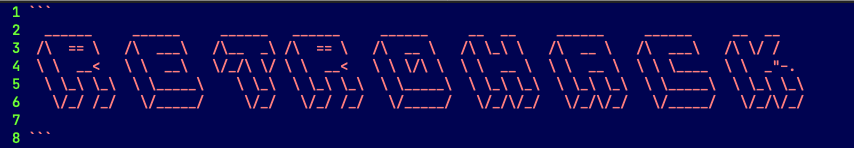
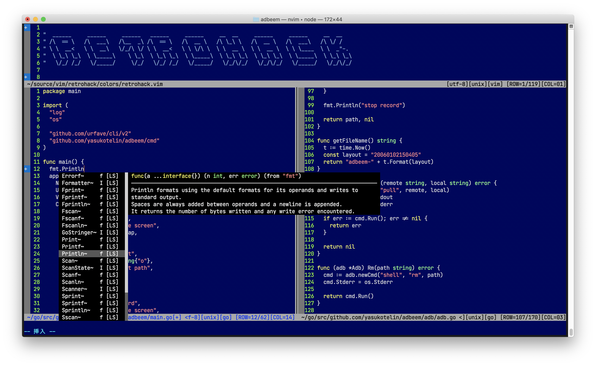

Inspired by vim default bundle colorscheme "darkblue".

- Supports Windows, macOS and Linux!
- Supported CUI and GUI.

## How to instal

If you use any vim plugin manager, refer to the following.

**vim-plug**

```vim
Plug 'yasukotelin/retrohack'
```

**dein.vim**

```vim
call dein#add('yasukotelin/retrohack')
```

**Manual Install**

If you want to manual install, you download `colors/retrohack.vim` and puts on your `~/.vim/colors` directory.

Finally, Write to your `.vimrc` or if you use NeoVim, write your `init.vim`.

```vimrc
colorscheme retrohack
```

## Setting

### Underline

If you want to show the cursorline, you write this.

```
set cursorline
```

You doesn't want to show the cursorline. You write this.

```
set nocursorline
```

## Screenshots



## Licence

MIT Licence

## Author

yasukotelin
